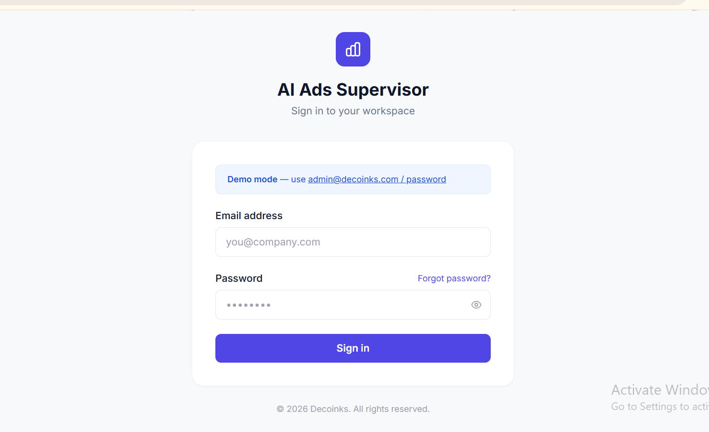
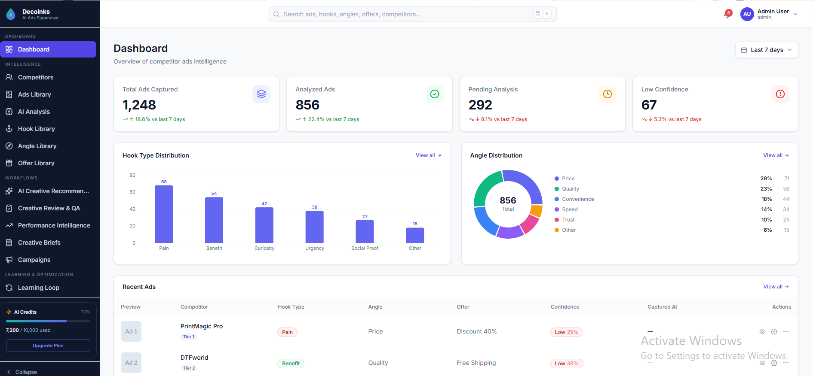

<h1 align="center">📣 AI Ads Supervisor</h1>

<p align="center">
  <b>A polished React + Vite competitor Meta ads intelligence dashboard with AI-style ad analysis screens, competitor tracking, ads library, hook/angle/offer libraries, review queues, creative workflows, campaign briefs, analytics charts, mock API fixtures, and frontend testing setup.</b>
</p>

<p align="center">
  
  
  
  
  
  
  
  
  
  
  
  
</p>

<p align="center">
  <b>Competitor Tracking</b> •
  <b>Ads Library</b> •
  <b>AI Analysis</b> •
  <b>Hooks</b> •
  <b>Angles</b> •
  <b>Offers</b> •
  <b>Review Queue</b> •
  <b>Creative Briefs</b>
</p>

---

## 📸 Project Screenshots

| Login | Dashboard |
|---|---|
| |  |

---

## 🚀 Project Overview

**AI Ads Supervisor** is a modern **React + Vite frontend dashboard** for monitoring competitor Meta ads, reviewing AI-generated advertising insights, managing ad intelligence workflows, and preparing creative/campaign briefs.

The project includes a login screen, protected dashboard layout, competitor management, ads library, ad detail pages, AI analysis dashboards, hook/angle/offer libraries, creative review screens, review queue workflow, low-confidence review pages, performance intelligence views, campaign screens, user management, settings, and activity logs.

The application is built as a **frontend-only project**. It does not include an ASP.NET, Node.js, Python, Laravel, or database backend inside this repository. However, it can run successfully in local demo mode because it includes local mock API fixtures and the default `.env` is configured with:

```env
VITE_USE_MOCKS=true
```

> **Important:** This is a **portfolio/demo frontend application**, not a real Meta Ads integration. It does not connect to the real Meta Ads API, Facebook Ads Library API, OpenAI API, payment APIs, or production backend services unless you build and connect a separate backend.

---

## 🎯 Project Purpose

Marketing teams often need to track competitor ads, understand which messages are working, compare hooks and offers, identify winning creative patterns, and convert insights into campaign briefs.

**AI Ads Supervisor** demonstrates these ideas in a learning-friendly React project. It focuses on building a polished dashboard UI with realistic advertising intelligence workflows while keeping backend dependency optional through mock data.

This project is suitable for portfolio practice because it demonstrates:

- React dashboard development
- Vite project setup
- Protected frontend routing
- Reusable component architecture
- API abstraction layer
- Mock API/data fixture strategy
- React Query data fetching patterns
- Zustand state management
- Form handling and validation
- Charts and analytics screens
- Review/approval workflow UI
- Frontend testing with Vitest and Playwright
- Production build and deployment configuration

---

## 🎯 Key Highlights

- 📣 Competitor Meta ads intelligence dashboard
- 🔐 Mock login with protected routes
- 📊 Dashboard KPI cards and advertising insights
- 🧑‍💼 Competitor management screen
- 🗂️ Ads library with ad list, filters, status, confidence, hook, angle, and offer indicators
- 🧾 Add new competitor ad flow with form and media upload structure
- 🔎 Ad detail page for inspecting creative, copy, status, AI result, and metadata
- 🤖 AI analysis dashboard with performance timeline, confidence distribution, top angles, and winning ads
- 🪝 Hook library with summary cards, tables, trend data, type distribution, and performance charts
- 🎯 Angle library with summary, charts, trends, and table views
- 🏷️ Offer library with offer summaries, distributions, trends, and performance insights
- ✅ Review queue, manual review, low-confidence review, approve/update/rerun/reassign flows
- 🎨 Creative review and creative performance workflow screens
- 📝 Brief list, brief generator, and brief detail pages
- 🚀 Campaign list and campaign wizard screens
- 🔁 Learning loop, prediction accuracy, recommendations, and insight log pages
- 👥 User management page
- ⚙️ Settings page and activity logs page
- 🧪 Vitest and Playwright testing setup
- ☁️ Vercel/Netlify-friendly SPA deployment configuration
- 🧩 Mock fixtures allow local use without a backend

---

## ✨ Features

### 🔐 Authentication Features

| Feature | Description |
|---|---|
| Login Page | Provides a clean login screen for workspace access |
| Mock Login | Allows demo login without a backend when `VITE_USE_MOCKS=true` |
| Protected Routes | Redirects unauthenticated users to `/login` |
| Auth Store | Uses Zustand with persistence for token and user state |
| Local Token | Stores `auth_token` in browser local storage for mock/demo routing |
| Demo Users | Includes admin and analyst demo login accounts |

---

### 📊 Dashboard Features

| Feature | Description |
|---|---|
| KPI Cards | Shows high-level performance and intelligence metrics |
| Top Hooks | Displays winning ad hooks from fixture/API data |
| Top Angles | Shows common or high-performing ad angles |
| Top Offers | Displays offer types and performance-style summaries |
| Recent Activity | Dashboard-style overview of ad intelligence activity |
| Chart Components | Uses reusable chart cards and Recharts visualizations |

---

### 🧑‍💼 Competitor Management Features

| Feature | Description |
|---|---|
| Competitor List | Displays competitors tracked by the workspace |
| Competitor Summary | Shows total competitors and summary metrics |
| Add Competitor Flow | Provides structure for adding competitor records |
| API Module | Uses `src/api/competitors.js` for real or mock data |
| Mock Fixture | Uses `src/api/_fixtures/competitors.js` in demo mode |

---

### 🗂️ Ads Library Features

| Feature | Description |
|---|---|
| Ads List | Shows competitor ads in a searchable dashboard-style view |
| Add New Ad | Provides an ad creation form and upload-ready frontend flow |
| Ad Detail | Displays details for a selected ad |
| Ad Metadata | Tracks platform, status, competitor, confidence, hook, angle, and offer |
| Creative Preview | Includes reusable components for previewing ad creative content |
| API Integration | Uses `/competitor-ads` style endpoints when mock mode is disabled |
| Mock Data | Uses local fixture ads when `VITE_USE_MOCKS=true` |

---

### 🤖 AI Analysis Features

| Feature | Description |
|---|---|
| AI Summary | Displays AI-style ad intelligence summary metrics |
| Performance Timeline | Shows trend data for ad performance over time |
| Top Angles Donut | Visualizes angle distribution using chart components |
| Confidence Distribution | Shows confidence score distribution for AI suggestions |
| Winning Ads | Displays winning/high-performing ads from fixture/API data |
| Bulk Analyze Flow | Includes API module support for bulk ad analysis requests |

> The current repository only includes the frontend UI and mock analysis data. Real AI analysis requires a separate backend service.

---

### 🪝 Hook Library Features

| Feature | Description |
|---|---|
| Hook Summary | Displays total hooks and high-level hook metrics |
| Type Distribution | Visualizes hook categories/types |
| Hook Performance | Shows comparative hook performance data |
| Hook Trends | Displays trend data for hooks over time |
| Hook Table | Lists hook records in a table-style layout |

---

### 🎯 Angle Library Features

| Feature | Description |
|---|---|
| Angle Summary | Displays angle-level KPI data |
| Type Distribution | Groups selling angles by type/category |
| Performance View | Shows angle performance-style metrics |
| Trend View | Displays changes in angle usage over time |
| Angle Table | Lists angle records for review and analysis |

---

### 🏷️ Offer Library Features

| Feature | Description |
|---|---|
| Offer Summary | Displays offer-level summary cards |
| Offer Type Distribution | Shows distribution of offers by type |
| Offer Performance | Displays offer performance-style data |
| Offer Trends | Shows offer trend movement over time |
| Offer Table | Lists offer records for review |

---

### ✅ Review & QA Workflow Features

| Feature | Description |
|---|---|
| Review Queue | Lists ads or insights waiting for review |
| Queue Summary | Shows review queue summary metrics |
| Manual Review | Opens a specific review item for manual inspection |
| Low Confidence Queue | Displays AI results that need extra human review |
| Approve Review | Supports approving review items |
| Update Review | Supports updating corrected review values |
| Bulk Approve | Supports bulk approve workflow through API module |
| Bulk Rerun AI | Supports rerunning AI analysis for selected records |
| Bulk Reassign | Supports assigning selected review items to another user |

---

### 🎨 Creative & Performance Workflow Features

| Feature | Description |
|---|---|
| Creative Review | Provides UI for creative quality review |
| Performance Intelligence | Shows creative performance insight screens |
| Creative Detail | Shows detail view for selected creative performance record |
| Recommendations | Displays AI creative recommendation page |
| Learning Loop | Shows optimization feedback loop page |
| Prediction Accuracy | Shows AI prediction accuracy page |
| Insight Log | Displays historical insight/activity-style entries |

---

### 📝 Briefs & Campaign Features

| Feature | Description |
|---|---|
| Brief List | Displays generated or saved creative briefs |
| Brief Generator | Provides a frontend flow for generating campaign briefs |
| Brief Detail | Shows a selected brief detail page |
| Campaign List | Displays campaign records |
| Campaign Wizard | Provides multi-step campaign creation UI |
| API Modules | Uses `briefs.js` and `campaigns.js` to separate data logic |

---

### ⚙️ System/Admin Features

| Feature | Description |
|---|---|
| Users Page | Displays user management UI |
| Settings Page | Shows workspace/system settings UI |
| Activity Logs | Displays activity log style screen |
| App Shell | Uses a shared sidebar/layout wrapper for protected pages |
| Legacy Aliases | Redirects old route names to updated routes |

---

## 🧑‍💼 Demo Roles / Users

| Email | Password | Role | Purpose |
|---|---|---|---|
| `admin@decoinks.com` | `password` | Admin | Demo workspace/admin-style user |
| `analyst@decoinks.com` | `password` | Analyst | Demo analyst user |

> These accounts work only in mock mode. For a production app, authentication should be handled by a secure backend with hashed passwords, sessions/JWTs, refresh tokens, and role-based authorization.

---

## 🛠 Tech Stack

| Layer | Technologies |
|---|---|
| Frontend | React 18.3.1 |
| Build Tool | Vite 8.0.10 |
| Language | JavaScript, JSX |
| Styling | Tailwind CSS 3.4.19, PostCSS, Autoprefixer |
| Routing | React Router DOM 6.30.3 |
| Server State | TanStack React Query 5.100.9 |
| Local State | Zustand 5.0.13 |
| API Client | Axios 1.16.0, Fetch on login fallback |
| Forms | React Hook Form 7.75.0 |
| Validation | Zod 4.4.3, Hookform Resolvers |
| UI Primitives | Radix UI Dialog, Dropdown Menu, Popover, Tabs, Tooltip |
| UI Helpers | Headless UI, clsx, tailwind-merge |
| Charts | Recharts 3.8.1 |
| Icons | Lucide React 1.14.0 |
| Notifications | React Hot Toast 2.6.0 |
| Dates | date-fns 4.1.0 |
| Unit/Integration Tests | Vitest 4.1.5, Testing Library, jest-axe, jsdom |
| E2E Tests | Playwright 1.59.1 |
| Mocking | Local fixtures, MSW dependency available |
| Code Quality | ESLint 9, Prettier 3, Prettier Tailwind plugin |
| Deployment | Vercel config, Netlify `_redirects`, static `dist/` output |

---

## 🏗 Architecture Overview

The project follows a frontend-only architecture with a clean separation between routes, features, components, API modules, hooks, utilities, and state stores.

```text
Meta-ADs-main/
├── public/
│   ├── _redirects
│   ├── favicon.svg
│   └── icons.svg
│
├── src/
│   ├── api/
│   │   ├── _fixtures/
│   │   │   ├── ads.js
│   │   │   ├── ai-analysis.js
│   │   │   ├── angles.js
│   │   │   ├── briefs.js
│   │   │   ├── campaigns.js
│   │   │   ├── competitors.js
│   │   │   ├── dashboard.js
│   │   │   ├── hooks.js
│   │   │   ├── offers.js
│   │   │   ├── performance.js
│   │   │   ├── review.js
│   │   │   ├── settings.js
│   │   │   └── users.js
│   │   ├── ads.js
│   │   ├── ai.js
│   │   ├── aiAnalysis.js
│   │   ├── angles.js
│   │   ├── briefs.js
│   │   ├── campaigns.js
│   │   ├── client.js
│   │   ├── competitors.js
│   │   ├── dashboard.js
│   │   ├── hooks.js
│   │   ├── offers.js
│   │   ├── performance.js
│   │   ├── review.js
│   │   ├── settings.js
│   │   ├── transport.js
│   │   └── users.js
│   │
│   ├── components/
│   │   ├── charts/
│   │   ├── layout/
│   │   ├── shared/
│   │   └── ui/
│   │
│   ├── features/
│   │   ├── activity-logs/
│   │   ├── ad-detail/
│   │   ├── ads-library/
│   │   ├── ai-analysis/
│   │   ├── angles/
│   │   ├── briefs/
│   │   ├── campaigns/
│   │   ├── competitors/
│   │   ├── creative-briefs/
│   │   ├── creative-performance/
│   │   ├── creative-review/
│   │   ├── dashboard/
│   │   ├── hooks/
│   │   ├── insight-log/
│   │   ├── learning-loop/
│   │   ├── low-confidence/
│   │   ├── manual-review/
│   │   ├── offers/
│   │   ├── performance/
│   │   ├── prediction-accuracy/
│   │   ├── recommendations/
│   │   ├── review/
│   │   ├── settings/
│   │   └── users/
│   │
│   ├── hooks/
│   │   ├── queries/
│   │   └── useDebounce.js
│   │
│   ├── lib/
│   │   ├── confidence.js
│   │   ├── constants.js
│   │   ├── formatters.js
│   │   ├── utils.js
│   │   └── validators.js
│   │
│   ├── pages/
│   │   └── Login/
│   │
│   ├── routes/
│   │   └── AppRoutes.jsx
│   │
│   ├── store/
│   │   ├── useAuthStore.js
│   │   ├── useBriefStore.js
│   │   ├── useCampaignStore.js
│   │   ├── useSidebarStore.js
│   │   └── useUIStore.js
│   │
│   ├── styles/
│   │   └── globals.css
│   │
│   ├── App.jsx
│   └── main.jsx
│
├── e2e/
├── coverage/
├── .env
├── .gitignore
├── .prettierrc
├── eslint.config.js
├── index.html
├── package.json
├── package-lock.json
├── playwright.config.js
├── postcss.config.js
├── tailwind.config.js
├── vercel.json
├── vite.config.js
├── vitest.config.js
├── README.md
└── LICENSE
```

---

## 🔄 Application Flow

### Login Flow

```text
Open Application
        ↓
Redirect to /login if no token exists
        ↓
Enter demo email and password
        ↓
Mock login generates local token
        ↓
Token and user are saved in Zustand/local storage
        ↓
Redirect to /dashboard
```

### Competitor Intelligence Flow

```text
Login
        ↓
Open Competitors
        ↓
Review competitor records
        ↓
Open Ads Library
        ↓
Inspect competitor ads
        ↓
Open Ad Detail
        ↓
Review hook, angle, offer, status, confidence, and analysis metadata
```

### AI Analysis Flow

```text
Open AI Analysis
        ↓
Review summary metrics
        ↓
Check performance timeline
        ↓
Inspect top angles and confidence distribution
        ↓
Review winning ads
        ↓
Use insights for creative recommendations or briefs
```

### Review Queue Flow

```text
Open Review Queue
        ↓
Filter or inspect review items
        ↓
Open Manual Review page
        ↓
Approve, update, rerun, or reassign item
        ↓
Low-confidence items can be reviewed separately
```

### Creative Brief Flow

```text
Open Briefs
        ↓
Create new brief
        ↓
Use competitor insights, hooks, angles, and offers
        ↓
Generate or save creative brief
        ↓
Open detail page for campaign planning
```

### Campaign Flow

```text
Open Campaigns
        ↓
Start Campaign Wizard
        ↓
Select strategy and creative inputs
        ↓
Create campaign record
        ↓
Review campaign list
```

---

## 📡 API / Mock Data System

The app uses a central API abstraction. Each API module supports two modes:

| Mode | Behavior |
|---|---|
| Mock Mode | Uses local fixture data from `src/api/_fixtures/` |
| API Mode | Calls real backend endpoints using Axios and `VITE_API_URL` |

The mock switch is controlled by:

```env
VITE_USE_MOCKS=true
```

The API client is located at:

```text
src/api/client.js
```

The mock/real transport switch is located at:

```text
src/api/transport.js
```

```js
export const USE_MOCKS = import.meta.env.VITE_USE_MOCKS === 'true'
```

### Expected Backend Endpoint Areas

If you connect a real backend later, it should provide endpoints similar to these:

| Area | Example Endpoints | Purpose |
|---|---|---|
| Auth | `POST /auth/login` | Login and user session |
| Dashboard | `GET /dashboard/summary`, `/dashboard/hooks`, `/dashboard/angles`, `/dashboard/offers` | Dashboard metrics |
| Competitors | `GET /competitors`, `POST /competitors`, `GET /competitors/summary` | Competitor tracking |
| Ads | `GET /competitor-ads`, `POST /competitor-ads`, `GET /competitor-ads/:id`, `PUT /competitor-ads/:id` | Ads library |
| AI | `POST /ads/:id/analyze`, `POST /ads/bulk-analyze` | AI analysis actions |
| AI Analysis | `GET /ai-analysis/summary`, `/timeline`, `/angles`, `/confidence-dist`, `/winning-ads` | Analysis charts |
| Hooks | `GET /hooks`, `/hooks/summary`, `/hooks/type-dist`, `/hooks/performance`, `/hooks/trend` | Hook library |
| Angles | `GET /angles`, `/angles/summary`, `/angles/type-dist`, `/angles/performance`, `/angles/trend` | Angle library |
| Offers | `GET /offers`, `/offers/summary`, `/offers/type-dist`, `/offers/performance`, `/offers/trend` | Offer library |
| Review | `GET /review-queue`, `POST /review/:id/approve`, `POST /review/:id/update` | Review workflow |
| Briefs | `GET /briefs`, `GET /briefs/:id`, `POST /briefs/generate` | Creative briefs |
| Campaigns | `GET /campaigns`, `POST /campaigns` | Campaign planning |
| Performance | `GET /performance/creatives` | Creative performance |
| Users | `GET /users`, `POST /users`, `PUT /users/:id`, `DELETE /users/:id` | User management |
| Settings | `GET /settings`, `PUT /settings` | Workspace settings |

---

## 🧭 Frontend Routes / Pages

| Route | Page / Purpose |
|---|---|
| `/login` | Public login page |
| `/dashboard` | Main dashboard |
| `/competitors` | Competitor management |
| `/ads` | Ads library |
| `/ads/new` | Add new competitor ad |
| `/ads/:id` | Ad detail page |
| `/ai-analysis` | AI analysis dashboard |
| `/hooks` | Hook library |
| `/angles` | Angle library |
| `/offers` | Offer library |
| `/recommendations` | AI creative recommendations |
| `/creative-review` | Creative review workflow |
| `/performance` | Performance intelligence |
| `/performance/creative/:id` | Creative performance detail |
| `/briefs` | Creative briefs list |
| `/briefs/new` | Brief generator |
| `/briefs/:id` | Brief detail |
| `/campaigns` | Campaign list |
| `/campaigns/new` | Campaign wizard |
| `/learning-loop` | Learning loop insights |
| `/insight-log` | Insight log |
| `/prediction-accuracy` | Prediction accuracy page |
| `/review` | Review queue |
| `/review/:id` | Manual review page |
| `/low-confidence` | Low-confidence review queue |
| `/settings` | Settings page |
| `/users` | User management page |
| `/activity-logs` | Activity logs page |

### Legacy Route Redirects

| Old Route | Redirects To |
|---|---|
| `/ads-library` | `/ads` |
| `/hook-library` | `/hooks` |
| `/angle-library` | `/angles` |
| `/offer-library` | `/offers` |
| `/ai-creative-recommendations` | `/recommendations` |
| `/creative-review-qa` | `/creative-review` |
| `/performance-intelligence` | `/performance` |
| `/creative-briefs` | `/briefs` |
| `/review-queue` | `/review` |

---

## ⚙️ Installation Guide

### Requirements

- Node.js 20 or newer
- npm 10 or newer
- Git
- Visual Studio Code recommended
- Optional: Vercel or Netlify account for deployment

Check installed versions:

```bash
node -v
npm -v
```

---

### 1️⃣ Clone or Extract the Project

If using Git:

```bash
git clone https://github.com/your-username/Meta-ADs.git
cd Meta-ADs
```

If using the uploaded ZIP:

```bash
unzip Meta-ADs-main.zip
cd Meta-ADs-main
```

On Windows, you can also extract the ZIP manually, then open the folder in VS Code.

---

### 2️⃣ Install Dependencies

Because the project includes `package-lock.json`, the recommended command is:

```bash
npm ci
```

Alternative command:

```bash
npm install
```

---

### 3️⃣ Environment Configuration

The uploaded project already includes `.env`.

For local demo mode, keep it as:

```env
VITE_API_URL=http://localhost:8000/api
VITE_USE_MOCKS=true
```

| Variable | Required | Description |
|---|---:|---|
| `VITE_API_URL` | Yes | Backend API base URL. Used only when mock mode is disabled. |
| `VITE_USE_MOCKS` | No | Set to `true` for local fixtures. Set to `false` for real backend API calls. |

> Keep `VITE_USE_MOCKS=true` if you only have this frontend repository.

---

### 4️⃣ Run the Frontend

Start the development server:

```bash
npm run dev
```

Open the app:

```text
http://localhost:5173
```

---

### 5️⃣ Login in Demo Mode

Use one of these accounts:

```text
Email: admin@decoinks.com
Password: password
```

```text
Email: analyst@decoinks.com
Password: password
```

---

### 6️⃣ Correct Local Run Order

This repository is frontend-only, so the default local run order is simple:

```bash
cd Meta-ADs-main
npm ci
npm run dev
```

Open:

```text
http://localhost:5173
```

If you later build a separate backend, run the backend first on:

```text
http://localhost:8000/api
```

Then set:

```env
VITE_USE_MOCKS=false
```

and restart the Vite dev server.

---

## 🪟 Windows CMD Commands

Use these commands after extracting the project:

```bat
cd C:\Users\YourName\Downloads\Meta-ADs-main
node -v
npm -v
npm ci
npm run dev
```

Open in browser:

```text
http://localhost:5173
```

### Windows PowerShell

```powershell
cd C:\Users\YourName\Downloads\Meta-ADs-main
node -v
npm -v
npm ci
npm run dev
```

---

## 🧪 Testing Commands

### Unit / Integration Tests

```bash
npm run test
```

### Watch Mode

```bash
npm run test:watch
```

### Test Coverage

```bash
npm run test:coverage
```

Coverage output:

```text
coverage/
```

### Vitest UI

```bash
npm run test:ui
```

### Playwright E2E Tests

Install Playwright browsers once if needed:

```bash
npx playwright install
```

Run E2E tests:

```bash
npm run test:e2e
```

Open Playwright UI:

```bash
npm run test:e2e:ui
```

Run headed E2E tests:

```bash
npm run test:e2e:headed
```

### Visual Regression Tests

```bash
npm run test:snapshots
```

Update snapshots:

```bash
npm run test:snapshots:update
```

### Run All Tests

```bash
npm run test:all
```

---

## 📦 Production Build

Create production build:

```bash
npm run build
```

Build output:

```text
dist/
```

Preview production build locally:

```bash
npm run preview
```

Open:

```text
http://localhost:4173
```

---

## ☁️ Deployment Guide

### Vercel

The project includes `vercel.json` for SPA routing support.

Use these settings:

```text
Build Command: npm run build
Output Directory: dist
Install Command: npm ci
```

For demo deployment without backend:

```env
VITE_USE_MOCKS=true
VITE_API_URL=http://localhost:8000/api
```

For real deployment with backend:

```env
VITE_USE_MOCKS=false
VITE_API_URL=https://your-api-domain.com/api
```

---

### Netlify

The project includes:

```text
public/_redirects
```

Use these settings:

```text
Build command: npm run build
Publish directory: dist
```

---

### Static Hosting / Nginx

Build the project:

```bash
npm run build
```

Serve the `dist/` folder and redirect all SPA routes to `index.html`.

Example Nginx config:

```nginx
server {
    listen 80;
    server_name your-domain.com;

    root /var/www/meta-ads/dist;
    index index.html;

    location / {
        try_files $uri $uri/ /index.html;
    }
}
```

---

## 📜 Available Scripts

| Script | Description |
|---|---|
| `npm run dev` | Starts the Vite development server with hot reload |
| `npm run build` | Creates a production build in `dist/` |
| `npm run preview` | Previews the production build locally |
| `npm run lint` | Runs ESLint checks |
| `npm run format` | Formats project files using Prettier |
| `npm run test` | Runs Vitest unit/integration tests once |
| `npm run test:watch` | Runs Vitest in watch mode |
| `npm run test:coverage` | Runs tests with coverage report |
| `npm run test:ui` | Opens Vitest UI |
| `npm run test:e2e` | Runs Playwright E2E tests |
| `npm run test:e2e:ui` | Opens Playwright UI |
| `npm run test:e2e:headed` | Runs Playwright tests in headed mode |
| `npm run test:snapshots` | Runs visual regression snapshot tests |
| `npm run test:snapshots:update` | Updates visual regression snapshots |
| `npm run test:all` | Runs Vitest tests and Playwright tests |

---

## 🧪 Testing Checklist

- [ ] Install dependencies with `npm ci`
- [ ] Check `.env` has `VITE_USE_MOCKS=true`
- [ ] Run development server with `npm run dev`
- [ ] Open `/login`
- [ ] Login using `admin@decoinks.com / password`
- [ ] Confirm redirect to `/dashboard`
- [ ] Review dashboard cards and charts
- [ ] Open competitors page
- [ ] Open ads library
- [ ] Open ad detail page
- [ ] Add a new competitor ad through the frontend form
- [ ] Open AI analysis page
- [ ] Review hooks library
- [ ] Review angles library
- [ ] Review offers library
- [ ] Open recommendations page
- [ ] Open creative review page
- [ ] Open performance intelligence page
- [ ] Open creative performance detail page
- [ ] Open briefs page
- [ ] Open brief generator page
- [ ] Open campaigns page
- [ ] Open campaign wizard
- [ ] Open review queue
- [ ] Open manual review page
- [ ] Open low-confidence queue
- [ ] Open users page
- [ ] Open settings page
- [ ] Open activity logs page
- [ ] Run `npm run test`
- [ ] Run `npm run build`
- [ ] Preview build with `npm run preview`
- [ ] Add real screenshots under `docs/screenshots/`

---

## ✅ Recruiter Highlights

This project demonstrates practical frontend development skills, including:

- ✅ React 18 frontend development
- ✅ Vite modern tooling
- ✅ Feature-based project structure
- ✅ Protected route implementation
- ✅ Zustand store usage
- ✅ TanStack Query server-state patterns
- ✅ Axios API client and request interceptor setup
- ✅ Mock API fixture architecture
- ✅ Dashboard UI development
- ✅ Reusable component organization
- ✅ Tables, filters, cards, and analytics screens
- ✅ Chart implementation with Recharts
- ✅ Form handling and validation setup
- ✅ Review/approval workflow design
- ✅ Campaign/creative brief workflow UI
- ✅ User/settings/admin-style screens
- ✅ Vitest testing setup
- ✅ Playwright E2E testing setup
- ✅ Vercel/Netlify/static deployment readiness
- ✅ Clean portfolio-style documentation

---

## 🚀 Future Improvements

- 🔐 Add real backend authentication with JWT/refresh tokens
- 🧑‍💼 Add role-based authorization for admin/analyst permissions
- 🗄️ Build ASP.NET Core Web API backend
- 🗃️ Add SQL Server database with Entity Framework Core
- 🧾 Add migrations and seed data
- 📡 Connect real backend endpoints to current API modules
- 🤖 Add real AI analysis service for hook, angle, offer, and confidence extraction
- 📣 Add real Meta Ads Library API integration where allowed
- 📁 Add real file/media upload support for ad creatives
- 🧪 Increase unit and integration test coverage
- 🧪 Add more Playwright E2E coverage for all main workflows
- 🧹 Fix current ESLint warnings/errors before final portfolio submission
- 📸 Add real screenshots inside `docs/screenshots/`
- 📄 Add `.env.example`
- 🧰 Add CI/CD workflow for lint, tests, and build
- 📊 Replace all remaining mock/static screens with API-backed data
- 🔍 Improve global search and table filtering
- 📱 Improve mobile responsiveness for complex dashboard tables
- ☁️ Deploy frontend and backend separately with production environment variables
- 🔒 Add production security hardening before real use

---

## ⚠️ Educational Disclaimer

**AI Ads Supervisor** is a demo/portfolio project created for learning and practice. It should not be presented as a production advertising platform unless a real backend, security layer, database, AI service, and external API integrations are added.

The project currently does not include:

- Real ASP.NET backend
- Real database
- Real Meta Ads API integration
- Real Facebook Ads Library API integration
- Real AI model integration
- Real production authentication backend
- Real file storage service
- Production-level security hardening

Use this project for frontend practice, dashboard UI development, API integration structure, testing workflows, and portfolio presentation.

---

## 👨‍💻 Developed By

**Muhammad Ali Nawaz**  
Full Stack Developer
---

## 📄 License

This project is open-sourced software licensed under the [MIT license](LICENSE).

---

<p align="center">
  <b>⭐ If you like this project, consider starring the repository!</b>
</p>
